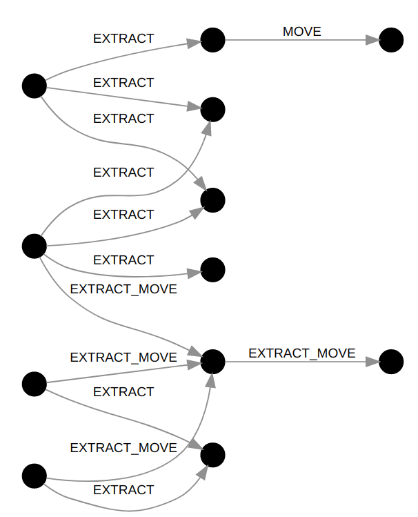
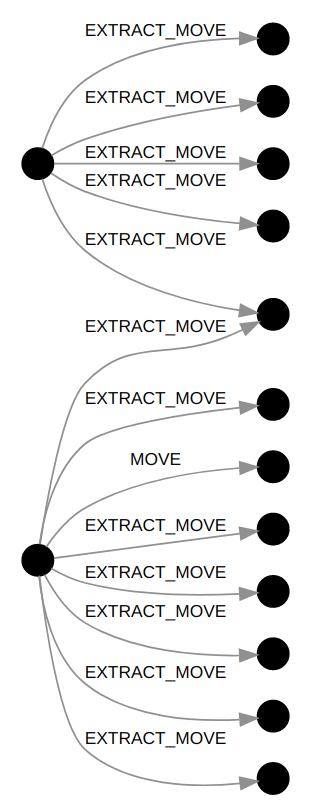
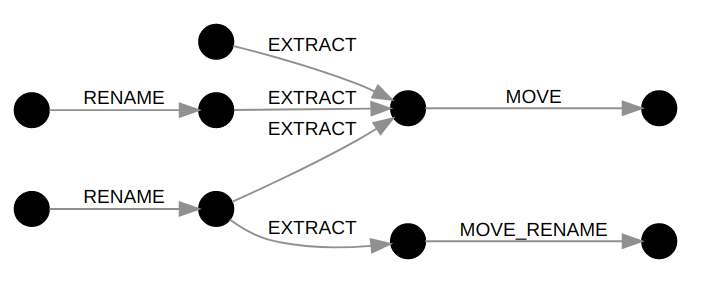
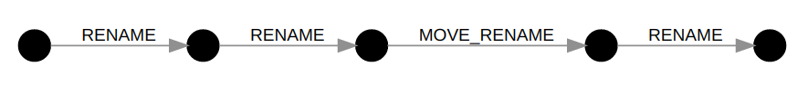
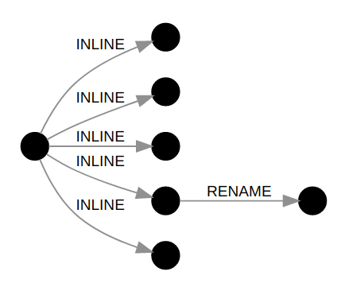
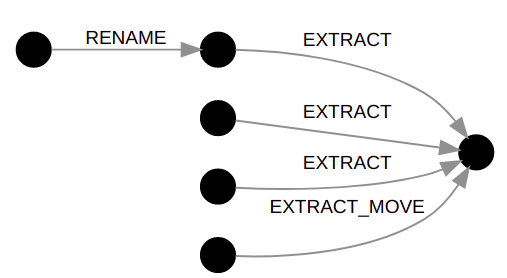
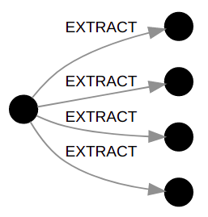

# Refactoring Graph

Refactoring Graph is a data structure to assess refactorings over time. The vertices are methods/functions and the edges represent refactoring operations.

## Manuscripts

Aline Brito, Andre Hora, Marco Tulio Valente. [Refactoring Graphs: Assessing Refactoring over Time](https://doi.org/10.1109/SANER48275.2020.9054864). In 27th International Conference on Software Analysis, Evolution and Reengineering (SANER), pages 367-377, 2020. [(Slides)](https://speakerdeck.com/aserg_ufmg/refactoring-graphs-assessing-refactoring-over-time)

```
@inproceedings{refGraph:SANER:2020, 
  author = {Aline Brito and Andre Hora and Marco Tulio Valente}, 
  title = {Refactoring Graphs: Assessing Refactoring over Time}, 
  booktitle = {27th International Conference on Software Analysis, Evolution and Reengineering (SANER)}, 
  year = {2020}, 
  pages = {367--377}
}
```

Aline Brito, Andre Hora, Marco Tulio Valente. [Characterizing refactoring graphs in Java and JavaScript projects](https://doi.org/10.1007/s10664-021-10023-3). Empirical Software Engineering, vol. 26, n. 6, 2021.

```
@article{refGraph:EMSE:2021, 
  author = {Aline Brito and Andre Hora and Marco Tulio Valente}, 
  title = {Characterizing Refactoring Graphs in {Java} and {JavaScript} Projects}, 
  journal = {Empirical Software Engineering}, 
  volume = {26}, 
  number = {6},
  pages = {1--43},  
  year = {2021}
}
```

## Examples of Refactoring Subgraphs

* Refactoring subgraph from `apache/dubbo`: [refactoring-graph.github.io/#/apache/dubbo/0](https://refactoring-graph.github.io/#/apache/dubbo/0) (Java)



* Refactoring subgraph from `elastic/elasticsearch`: [refactoring-graph.github.io/#/elastic/elasticsearch/713](https://refactoring-graph.github.io/#/elastic/elasticsearch/713) (Java)



* Refactoring subgraph from `facebook/fresco`: [refactoring-graph.github.io/#/facebook/fresco/226](https://refactoring-graph.github.io/#/facebook/fresco/226) (Java)



* Refactoring subgraph from `bumptech/glide`: [refactoring-graph.github.io/#/bumptech/glide/253](https://refactoring-graph.github.io/#/bumptech/glide/253) (Java)



* Refactoring subgraph from `facebook/react`: [refactoring-graph.github.io/#/facebook/react/77](https://refactoring-graph.github.io/#/facebook/react/77) (JavaScript)



* Refactoring subgraph from `quilljs/quill`: [refactoring-graph.github.io/#/quilljs/quill/24](https://refactoring-graph.github.io/#/quilljs/quill/24) (JavaScript)



* Refactoring subgraph from `vuejs/vue`: [refactoring-graph.github.io/#/vuejs/vue/32](https://refactoring-graph.github.io/#/vuejs/vue/32) (JavaScript)




